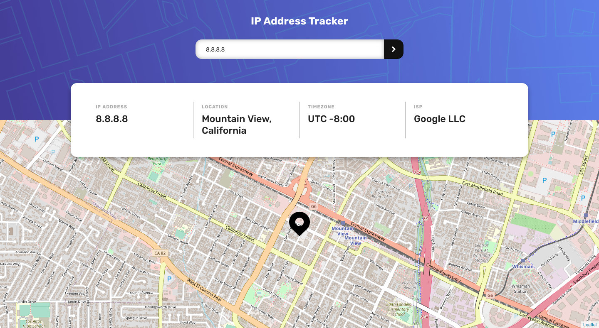

# Frontend Mentor - IP address tracker solution

This is a solution to
the [IP address tracker challenge on Frontend Mentor](https://www.frontendmentor.io/challenges/ip-address-tracker-I8-0yYAH0)
. Frontend Mentor challenges help you improve your coding skills by building realistic projects.

## Table of contents

- [Overview](#overview)
    - [The challenge](#the-challenge)
    - [Screenshot](#screenshot)
    - [Links](#links)
- [My process](#my-process)
    - [Built with](#built-with)
    - [What I learned](#what-i-learned)
    - [Continued development](#continued-development)
    - [Useful resources](#useful-resources)
- [Author](#author)
- [Acknowledgments](#acknowledgments)

## Overview

### The challenge

Users should be able to:

- View the optimal layout for each page depending on their device's screen size
- See hover states for all interactive elements on the page
- See their own IP address on the map on the initial page load
- Search for any IP addresses or domains and see the key information and location

### Screenshot



### Links

- Solution URL: [Github](https://github.com/MattInReality/ip-address-tracker)
- Live Site URL: [fm002.mattnorth.dev](https://fm002.mattnorth.dev)

## My process

### Built with

- [Vue3](https://v3.vuejs.org/) - JS framework
- Vue3 Composition API
- [Netlify Stored Functions](https://www.netlify.com/products/functions/) : For hiding api keys
- Semantic HTML5 markup
- CSS custom properties
- Flexbox
- CSS Grid
- Mobile-first workflow

### What I learned

I've used Vue 2 and Nuxt before but had never taken the dive into Vue 3's composition API. I thought for this project I
would experiment with it and found that I really enjoyed the modularity afforded by it.

I created a shared state module that allowed me to have a lightweight Vuex experience and avoided the use of props and
injection. It felt like a great example of what could be done with the composition API and why it was worth learning all
the extra syntax.

I also further stretched my legs with CSS grid and after many iterations, found a very flexible layout that allowed the
card to be properly positioned without any absolute positioning.

Here is a snippet for the grid. I've removed any unrelated properties.

```css
#app {
    height: 100vh;
    display: grid;
    grid-template-rows: repeat(2, 10rem) auto auto repeat(6, 1fr);
}

.main-header {
    grid-row: 1 / span 3;
    grid-column: 1;
}

.info-card {
    grid-row: 3 / span 2;
    grid-column: 1;
    place-self: center;
    height: max-content;
}

.map-card {
    grid-row: 4 / -1;
    grid-column: 1;
}
```

I found a [Dev.to blog post](https://dev.to/fabiorosado/hide-your-api-keys-with-netlify-functions-93m) about hiding API
keys with Netlify functions. Which I planned to use for deployment... until my API allowance ran out. Having found a new
api from [ipgeolocation.io](https://ipgeolocation.io/) I've rebuilt the state management to use the different response.
I also spent a significant amount of time playing with the Netlify functions and Netlify CLI.

The most important lesson learnt... To read the details of a free tier on an API before coding around it.

### Continued development

My immediate continued development will likely be a portfolio site followed by another Frontend Mentors project. But I'm
excited by the idea that the scope for future development is endless. I'd like to build something bigger in vue. I've
touched on React before and have some Udemy courses so could do something there. For backend, I'd like to build myself
an API proxy and learn more about rate limiting and CORS.

### Useful resources

- [Loading.io](https://loading.io/css/) - A nice source for CSS loaders some of which (or a modified version thereof)
  were used in this project.
- [Vue3 The Complete Guide](https://www.udemy.com/course/vuejs-2-the-complete-guide/) on Udemy. A little watch of the
  composition API videos helped me greatly.

## Author

- Frontend Mentor - [@MattInReality](https://www.frontendmentor.io/profile/MattInReality)
- Twitter - [@MattNorth_dev](https://www.twitter.com/MattNorth_dev)

## Acknowledgments

- [Jetbrains Webstorm](https://www.jetbrains.com/webstorm/) - Near the start of this project I started playing around
  with Webstorm and ended up buying the full suite of IDE's. I have really enjoyed learning to use this new tool and as
  someone who quite commonly thinks of better names for variables, and files long after they have been created and
  referenced, I really appreciate the power and simplicity of the refactoring tools.